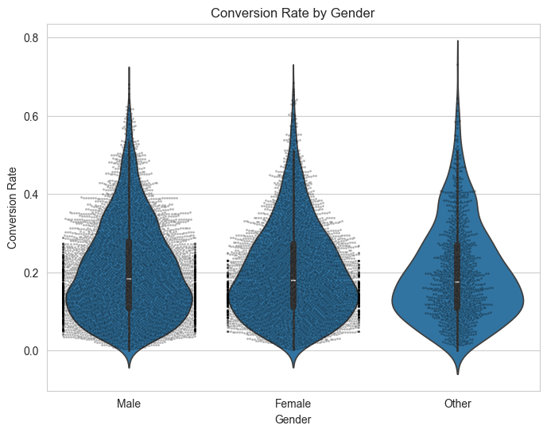
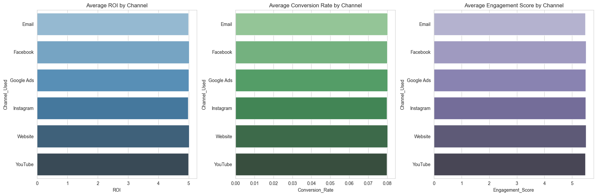

# 🧠 Causal Machine Learning for A/B Testing & Ads Optimization

## 📌 Project Overview
This project applies **causal machine learning techniques** to evaluate the **true impact of online advertisements** on user engagement—specifically **Click-Through Rate (CTR)** and **Conversion Rate**. Rather than relying on simple correlations, we focus on isolating the **causal effect** of ad exposure using robust econometric and machine learning models.

## 🎯 Project Objectives
- Estimate **Average Treatment Effect (ATE)** to assess the **true lift in conversions** due to ads.
- Identify **Heterogeneous Treatment Effects (HTE)** to understand which users benefit most.
- Develop **targeted ad strategies** for different user segments.
- Present explainable and data-driven policy recommendations for **ad spending optimization**.

---

## 📊 Datasets Used
1. **Criteo Sponsored Search Conversion Logs** ([Criteo Dataset](https://ailab.criteo.com/criteo-sponsored-search-conversion-log-dataset/))
   - 10,000 user records  
   - Demographics, ad types, placements, clicks, impressions, conversions

2. **Marketing Campaign Dataset**  
   - Contains campaign-level performance metrics (ROI, Engagement Score, etc.)

---

## 🧪 Methodology

### 1. Exploratory Data Analysis (EDA)
- **CTR:** Right-skewed. Most users 3–6%. ➝ Moderate engagement
- **Conversion Rate:** Heavily right-skewed ➝ Conversions are harder than clicks
- **Clicks:** Multimodal ➝ Indicates different user behavior segments
- **Income:** Bell-shaped ➝ Focus on middle-income users

### 2. CTR & Conversion Analysis by Categories
- **Gender & Location:** No major difference
- **Social Media Ads:** Higher CTR and Conversion Rate
- **Website Ads:** Lower engagement and conversions

### 3. Causal Inference Setup
- **Treatment Variable:** Treatment = 1 if user clicked at least once, else 0
- **Propensity Score Estimation:** Logistic Regression using user and ad features
- **Matching Strategy:** Nearest Neighbor Matching to balance treatment vs control groups

### 4. Average Treatment Effect (ATE)
- ATE = **+2.35%**
- ➝ Ads increased average conversion rate by 2.35%

### 5. Heterogeneous Treatment Effects (HTE)
- **Mean HTE:** +3.02%
- **Min HTE:** –79.8% ➝ Negative impact for some users
- **Max HTE:** +58.7% ➝ High responsiveness for others
- ➝ Personalization is crucial

---
## 📊 Visual Insights

#### Feature Distributions (EDA)

#### Correlation Heatmap

### 🎯 CTR Analysis

#### CTR by Gender

#### CTR by Location

#### CTR by Ad Type (Video vs Others)

#### CTR by Ad Placement - Social Media

#### CTR by Ad Placement - Website

---

### 📈 Conversion Rate Analysis

## 📈 Conversion Rate Analysis

### Conversion Rate by Gender

### Conversion Rate by Ad Placement – Social Media

### Conversion Rate by Ad Placement – Website

---

### 🌲 Heterogeneous Treatment Effect (HTE)

#### HTE by Gender

#### HTE Distribution - Video Ads vs Others

#### HTE Distribution - Social Media vs Others

#### HTE vs Income

#### HTE vs Age

---

## 🧩 Marketing Campaign Analysis
- Analyzed campaign performance using visual comparisons
- Compared **Email**, **Influencer**, and **Display** campaigns
- Metrics analyzed: ROI, Conversion Rate, Engagement Score

### 📊 Campaign Performance Comparison

#### ROI, Conversion Rate, and Engagement by Campaign Type

#### Radar Chart - Campaign Comparison

#### ROI, CR, and Engagement by Channel Used

---

## 🛠️ Tools & Libraries
- **Python**, **Pandas**, **NumPy**, **Matplotlib**, **Seaborn**
- **Scikit-learn:** Logistic Regression, Nearest Neighbors
- **EconML:** CausalForestDML for advanced causal analysis

---

## 📚 Key Takeaways
- Ads **do increase conversions**, but **effect is modest overall**
- **Not all users benefit** ➝ personalization is key
- **Social Media** placements outperform websites in both CTR and conversion
- Causal ML helps go **beyond correlation** to uncover **true ad impact**

---

## ✅ Final Outcome
This end-to-end project demonstrates a **data-driven pipeline** to measure ad effectiveness using **causal machine learning**. It enables **smarter targeting**, **better ad placement**, and **informed marketing decisions** grounded in real-world behavior.
